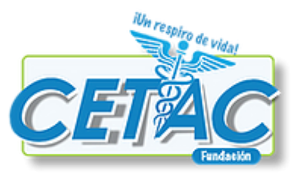

    
     
     
	
    
    
    

 

### 🏨 CETAC

CETAC es una organización que ayuda a personas que estén en una situación de crisis o pérdida. El trabajo de CETAC es acompañar, guiar y darle un servicio que los apoye a reencontrar el sentido en su vida. La organización busca una aplicación que ayude a los tanatólogos para manejar este servicio con sus clientes.

### 📱 Proyecto

Con el proyecto CETAC App se busca analizar, diseñar e implementar una aplicación móvil que permite ver la información general de la asociación CETAC y dar seguimiento a las sesiones de los usuarios que son atendidos en esta misma.

Mediante la aplicación, los tanatólogos tendrán la capacidad de abrir expedientes de usuarios, generar bitácoras por sesiones atendidas, ver el historial de las sesiones, dar de alta a los pacientes. y visualizar gráficas con la información recabada.

### 👨‍💻 Desarrolladores

- Alejandro Hernández - [werunthenite](https://github.com/werunthenite)
- Marco Bosquez - [MarcoBosglez](https://github.com/MarcoBosglez)
- Christian González - [christiangr](https://github.com/grchristian)
