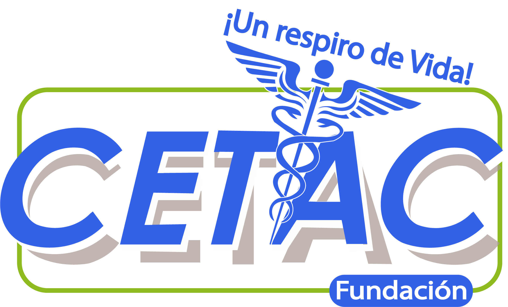

    

 

	
    
    
    

 

Vapor is an HTTP web framework for Swift. It provides a beautifully expressive and easy-to-use foundation for your next website, API, or cloud project.

Take a look at some of the [awesome stuff](https://github.com/Cellane/awesome-vapor) created with Vapor.

### 💧 Notas

Actualizar documentación PMO constantemente.

### 🚀 Proyecto

App programada en swift para CETAC.

### 💛 Desarrolladores

* Alejandro Hernández - [werunthenite](https://github.com/werunthenite)
* Marco Bosquez - [MarcoBosglez](https://github.com/MarcoBosglez)
* Christian González - [christiangr](https://github.com/grchristian)